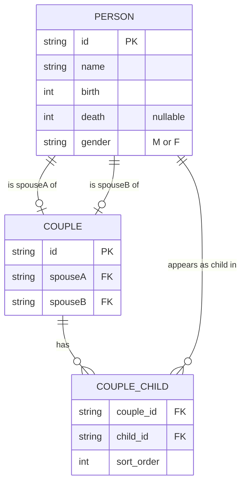

# Family Tree — Architecture Document

## Overview

A single-page, client-side family tree visualiser. All data is embedded directly in `index.html` as JavaScript arrays. There is no server, no database, and no build step — the app runs entirely in the browser using [D3.js v7](https://d3js.org/).

---

## Data Model

### Core entities

#### `Person`
Represents one individual.

| Field    | Type              | Description                          |
|----------|-------------------|--------------------------------------|
| `id`     | string (`"p1"…`)  | Unique person identifier             |
| `name`   | string            | Full name                            |
| `birth`  | number            | Birth year                           |
| `death`  | number \| `null`  | Death year; `null` means still alive |
| `gender` | `"M"` \| `"F"`   | Used for card colour theme           |

#### `Couple`
Represents a married pair and their children.

| Field      | Type              | Description                                  |
|------------|-------------------|----------------------------------------------|
| `id`       | string (`"c1"…`)  | Unique couple identifier                     |
| `spouseA`  | Person `id`       | First spouse (typically the bloodline member)|
| `spouseB`  | Person `id`       | Second spouse (married-in)                   |
| `children` | Person `id[]`     | Ordered list of child person IDs             |

> A child who later marries appears in two places: as a `children` entry in their parent's couple, and as `spouseA` in their own couple. Married-in spouses appear only as `spouseB` and are never listed in any couple's `children`.

---

## Entity–Relationship Diagram



> If this data were stored in a relational database the junction table `COUPLE_CHILD` would be needed to represent the one-to-many relationship between a couple and their children.

---

## Rendering Pipeline

The app runs through four sequential phases on every page load.

```
assignGenerations()  →  computeSubtreeWidths()  →  computePositions()  →  render()
```

### Phase 1 — Generation Assignment (`assignGenerations`)

A BFS starting from couple `c1` (Arthur + Eleanor). Each couple is assigned a `gen` integer (0-based). Children inherit `gen = parent.gen + 1`.

```
c1  gen=0  (Arthur + Eleanor)
├── c2  gen=1  (Thomas + Helen)
├── c3  gen=1  (Margaret + George)
└── c4  gen=1  (Robert + Clara)
    └── …
```

### Phase 2 — Subtree Widths (`computeSubtreeWidths`)

Bottom-up pass (deepest generation first). Each couple's `subtreeWidth` is the horizontal space its entire descendant tree needs.

- **Leaf couple** (no children): `max(COUPLE_W, soloLeafSpan)`
- **Interior couple**: `sum of child subtree widths + gaps`

### Phase 3 — X/Y Positions (`computePositions`)

Top-down BFS. Each couple receives:

| Property    | Meaning                                         |
|-------------|--------------------------------------------------|
| `cx`        | Horizontal centre of the couple pair             |
| `y`         | Top edge of the row (`gen × ROW_HEIGHT + PADDING`)|
| `yBot`      | Bottom edge (`y + NODE_H`)                       |
| `spouseAX`  | Left edge of spouseA card                        |
| `spouseBX`  | Left edge of spouseB card                        |

Solo leaf children (those who never marry) get `soloX`, `soloY`, and `soloCX` written directly onto the person object.

### Phase 4 — Render

SVG elements are created with D3 in two layers inside a `zoom-layer` group:

| Layer            | Contents                                              |
|------------------|-------------------------------------------------------|
| `connectorLayer` | `<line>` elements for spouse bars and parent→child branches |
| `nodeLayer`      | `<g.person>` groups containing card rect, avatar circle, name text, and years text |

**Connector geometry** (per couple):

1. Horizontal bar between the two spouse cards.
2. Vertical drop from couple centre down to `midY` (halfway between parent row bottom and child row top).
3. Horizontal bar across all children at `midY` (when >1 child).
4. Vertical drops from `midY` down to the **top-centre of each child's own card** (not the couple midpoint).

D3 zoom (`d3.zoom`) wraps the entire `zoom-layer` so the tree is pannable and zoomable. On load a `fitToViewport` transform is computed to show the whole tree at once.

---

## Layout Constants

| Constant      | Value  | Role                                              |
|---------------|--------|---------------------------------------------------|
| `NODE_W`      | 120 px | Person card width                                 |
| `NODE_H`      | 60 px  | Person card height                                |
| `SPOUSE_GAP`  | 12 px  | Horizontal gap between the two spouse cards       |
| `SUBTREE_GAP` | 48 px  | Horizontal gap between sibling subtrees           |
| `ROW_HEIGHT`  | 120 px | Vertical distance between generation top edges    |
| `VERTICAL_GAP`| 60 px  | Space between parent card bottom and child row top|
| `PADDING`     | 40 px  | Canvas padding on all sides                       |

---

## Current Dataset — 5 Generations

| Gen | Couples | People           |
|-----|---------|------------------|
| 0   | c1      | p1, p2           |
| 1   | c2–c4   | p3–p8            |
| 2   | c5–c10  | p9–p20           |
| 3   | c11–c15 | p21–p31          |
| 4   | —       | p32–p38 (leaves) |

38 people total · 15 couples · 15 married-in spouses with no blood relation to the root pair.
